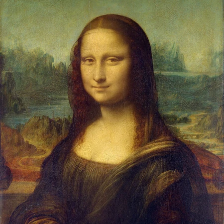
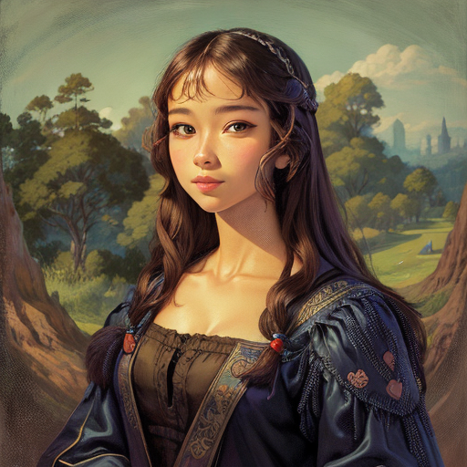
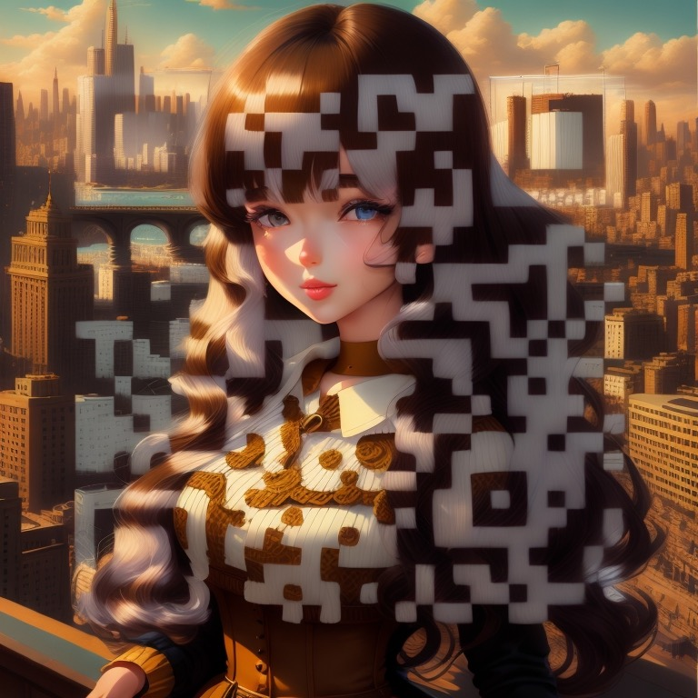

# Cartoon me 
Get the cartoon version of your image. This repo makes use of [Stable Diffusion v2](https://github.com/Stability-AI/stablediffusion) and [ReV Animated model](https://civitai.com/models/7371/rev-animated) to generate cartoonized image for a given one using its image-to-image capability.

In addition to generate cartoonized images, by loading the [QR code controlnet model](https://civitai.com/models/90472?modelVersionId=96366), it could generate fancy images with a readable QR code embedded. 

### Example

Input image  |           Generated Image            | Image with QR code 
:-------------------------:|:------------------------------------:|:--------------:
  |  | 

Live Demo at https://cartoonme.fun/